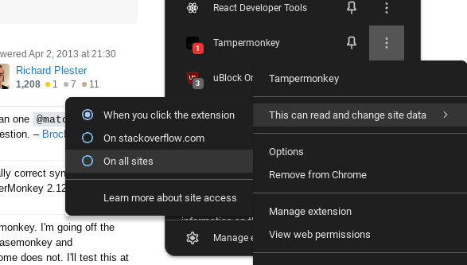

# Deletable

Lets you delete any element from a webpage or add any deleted element back (if u accidentally deleted it) from any webpage.

---

hold ` d ` then ` click ` on the element to delete it

hold ` e ` then ` click ` on the page anywhere to add the recently deleted element back

---

allow the extension to run on all sites to make it run automatically. otherwise you need to manually give it permission to run.

 
